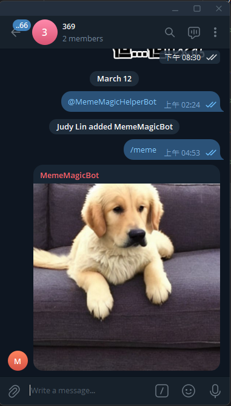

# Meme-Magic 🚀🎨

Meme-Magic 是一個基於 AI 的迷因圖片生成工具，結合 **Go + Gin + GORM** 和 **本地 AI 伺服器** 來幫助用戶快速產生迷因圖片，並透過 **Telegram Bot** 自動發佈！

---

## **✨ 主要功能**
✅ **AI 生成迷因圖片** - 使用 **本地 AI 伺服器** 根據 `prompt` 產生迷因圖片  
✅ **儲存迷因到資料庫** - 讓迷因圖片不會遺失，未來可以擴展排行榜、收藏功能  
✅ **Telegram Bot 自動發佈** - 用戶輸入 `/meme` 指令，機器人會自動生成並發送迷因  
✅ **API 支援** - 透過 REST API 讓外部應用程式也能調用

---

## **⚙️ 技術組合**
✅ **後端**：Go + Gin 框架  
✅ **資料庫**：GORM（支援 MySQL / PostgreSQL）  
✅ **AI 伺服器**：AI 迷因圖生成 (本地 Stable Diffusion)  
✅ **消息通知**：Telegram Bot（`telebot`）
✅ **其他**：MinIO 圖片儲存

---


## **🔧 環境設定**
1. **安裝 Go 1.19+**
   ```sh
   sudo apt install golang-go  # Ubuntu
   brew install go             # Mac
   ````

1. **設定環境變數**
   ```sh
   export TELEGRAM_BOT_TOKEN="your-telegram-bot-token"
   export DATABASE_URL="your-database-connection-url"
   export LOCAL_AI_URL="your-local-ai-server-url"
   ```


3. **下載專案**
   ```sh
   git clone https://github.com/your-repo/meme-magic.git
   cd meme-magic
   ```
4. **安裝依賴**
   ```sh
   go mod tidy
   ```
   
5. **啟動應用**
   ```sh
   go run main.go
   ```


---

## **📂 目錄結構**
```
meme-magic/
│── main.go              # 入口點
│── go.mod               # 依賴管理
│── config.yaml          # 設定檔
│── generated_image.png  # 已生成的圖片
│── ai/                  # AI 生成圖片相關
│   ├── dalle.go         # 第三方,須付費使用   
│   ├── hugging_face.go  # 第三方,須付費使用   
│   ├── my_local_ai.go   # 用來請求本地 AI Server (需另外啟動)
│   ├── replicate.go
│── api/                 # API 端點
│   ├── hello.go         # Hello World
│   ├── meme_api.go      # 迷因生成 AP
│   ├── telegram.go      # Telegram Bot API 控制
│── config/              # 設定管理
│   ├── config.go
│── core/                # 核心功能
│   ├── run.go
│   ├── viper.go
│── global/              # 全域變數
│   ├── global.go
│── initialize/          # 初始化
│   ├── gorm.go
│   ├── router.go
│── model/               # 數據模型
│   ├── meme.go
│── router/              # 路由
│   ├── meme.go          # 迷因 API 路由
│── service/             # 服務邏輯
│   ├── meme_service.go  # 負責 Meme CRUD 操作
│   ├── telegram_bot.go  # 負責 Telegram Bot 運行
```


[//]: # (## **📡 API 端點**)

[//]: # ()
[//]: # (- 啟動: POST /telegram/start)

[//]: # (- 停止: POST /telegram/stop)

---

## **🤖 Telegram Bot 指令
- 生成一張 AI 迷因並發送 : ``/meme``



---

## **🚀 未來擴展**
- **整合更強大的 NLP 來分析熱門話題(要收費先跳過)**  
- **使用者自訂迷因模板**
- **排行榜 & 收藏功能**
- **支援社群分享（Threads, Discord, Twitter）**
 

